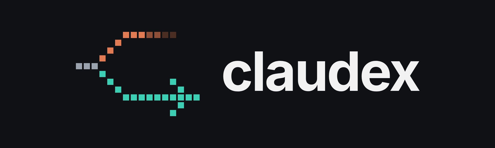

<div align="center">



# Claude when you can, Codex when you can't

**When Claude Code hits its usage limit, claudex switches to Codex CLI and hands it your last exchange and the state of your repo.**

<a href="https://github.com/karankumar24/claudex/actions/workflows/tests.yml"></a>
<a href="#install"></a>
<a href="LICENSE"></a>

</div>

---

Claude Code and Codex both cut you off when you reach your plan's limit, and moving to the other one by hand means explaining the task all over again. claudex sits in front of both CLIs. When one runs out, it asks, then reruns your prompt on the other with the context attached.

<table>
<tr>
<th width="50%">Without claudex</th>
<th width="50%">With claudex</th>
</tr>
<tr>
<td valign="top">

> **You:** now refactor it to use sessions instead
>
> **Claude:** You've hit your limit · resets 6pm (America/Los_Angeles)

</td>
<td valign="top">

> **You:** now refactor it to use sessions instead
>
> **claudex:** claude unavailable (QUOTA_EXHAUSTED). Switch to codex and continue? **y**
>
> **Codex:** From the handoff, we were going through the JWT auth flow. Here's how I'd move it to sessions...

</td>
</tr>
</table>

claudex also reads the reset time from that message and leaves Claude alone until 6pm.

## How it works

- `claudex chat` and `claudex ask` send each prompt to Claude first (you can change the order), resuming its last session.
- On a usage limit, that CLI goes on a cooldown: until the reset time in the message, or 60 minutes if there isn't one. Once you say yes, the same prompt goes to the other CLI in a fresh session, with the handoff and a git snapshot in front of it.
- A rate limit gets 3 retries with backoff before a switch. A login error or a crash stops with the error.
- Each turn updates `.claudex/`: `state.json` (sessions and cooldowns), `handoff.md` (the last exchange) and `transcript.ndjson` (every turn).

## Install

Needs Python 3.11 or newer, and both [Claude Code](https://code.claude.com/docs/en/overview) and [Codex CLI](https://github.com/openai/codex) installed and logged in:

```bash
npm i -g @anthropic-ai/claude-code   # claude
npm i -g @openai/codex               # codex
```

Then:

```bash
pipx install git+https://github.com/karankumar24/claudex.git
```

`pip install` with the same URL works too.

## Usage

Run it from the root of your repo:

```bash
claudex chat                                # a conversation; type exit to leave
claudex ask "what does this function do?"   # one prompt, then exit
claudex status                              # what's ready, what's cooling down, until when
claudex reset                               # delete .claudex/ for this repo (asks first)
```

`chat` and `ask` take `--prefer-provider codex` to start with Codex, and `--auto-switch yes` to switch without asking, or `no` to never switch.

### Through `claude` and `codex`

```bash
claudex install-wrappers
export PATH="$HOME/.claudex/bin:$PATH"
```

Now `claude`, `claudecode` and `codex` open whichever CLI isn't cooling down, starting with the one you typed. `claudex uninstall-wrappers` removes them.

## Configuration

Optional. Put `.claudex/config.toml` in a repo, or `~/.config/claudex/config.toml` for all of them. The repo file wins.

```toml
provider_order = ["claude", "codex"]

[claude]
allowed_tools = ["Bash", "Edit", "Read"]   # passed to claude as --allowedTools

[codex]
sandbox = "workspace-write"   # default "read-only"

[retry]
cooldown_minutes = 60         # used when a limit message has no reset time

[switch]
confirmation = "ask"          # ask, yes or no
```

Every option and its default is in [config.py](src/claudex/config.py).

## Your data

- claudex keeps its files in `.claudex/` in the folder you run it from, and talks only to `git` and the two CLIs. It doesn't handle API keys or logins; each CLI uses its own.
- `transcript.ndjson` keeps every prompt and reply in full and is never trimmed. Add `.claudex/` to your `.gitignore`; claudex doesn't do that for you.

## Good to know

- The handoff is short: your last prompt and reply, git status, the last five commits, the diff stat, and the full diff when it's small. Older turns don't carry over, and nothing from Codex is passed back when Claude's cooldown ends.
- The wrappers only choose which CLI to open. After that the real CLI runs on its own, with no handoff and no switch mid-session.
- Each turn runs `claude -p` or `codex exec` with a 5-minute limit, and you see only the final answer.
- Codex runs in a read-only sandbox by default, and Claude gets no extra tools. Loosen both in the config.
- Limits are spotted by matching the CLIs' error text, so if a CLI rewords it, claudex may stop instead of switching.
- `claudex reset` deletes all of `.claudex/`, including a `config.toml` you put there.
- Tested on Linux with Python 3.11 to 3.13. Not tried on Windows.

## Contributing

Issues and pull requests are welcome. For a dev setup, run `pip install -e . pytest`, then `pytest`. MIT licensed.
